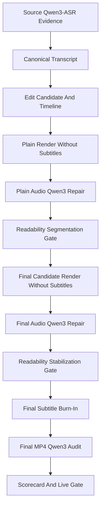

# RoughCut Final Subtitle Authority Refactor

Date: 2026-06-19

## Objective

Make the final rendered audio track the only authority for delivered subtitle timing, then close the loop with Qwen3-ASR before subtitles are burned into the final MP4.

This work is not an ASR-provider swap. Qwen3-ASR remains the authoritative ASR/alignment source. FunASR and faster-whisper are not fallback options for this workflow.

## Root-Cause Statement

Observed symptom:

- Browser playback of completed MP4s shows burned subtitles that are sometimes aligned, then suddenly drift by several seconds.
- Some outputs show many subtitles flashing through in a short window.
- Previous reports could still give high or perfect scores because they checked file existence, SRT shape, or sidecar timing instead of final MP4 audio versus burned subtitle timing.

First bad layer:

- The render boundary between packaged final audio and subtitle burn-in.

Suspected root cause:

- Source-ASR and plain-render subtitle timings were allowed to flow into packaged/final render as if they were final-time authorities.
- The final Qwen3 pass was positioned as an after-the-fact audit after the packaged video had already been rendered with subtitles. That can block a bad output, but it cannot repair the subtitle timing before burn-in.

Why it surfaced now:

- Earlier checks were mostly structural and could miss viewer-facing drift.
- Once real final-audio Qwen3 audits were added, the system started exposing the underlying contract break instead of silently shipping it.

## Target Framework

## Phase Exit Conditions

### Phase 0: Contract Lock

Exit condition:

- This document exists and is referenced from `docs/agent-current-state.md`.
- The active objective states that final audio, not source ASR or sidecar SRT shape, is the subtitle timing authority.
- Do-not-reopen decisions are recorded:
  - no ASR provider swap away from Qwen3;
  - no sidecar-subtitle blame for browser-visible burned subtitle drift;
  - no publishing or cover generation in the editing render chain.

### Phase 1: Boundary Audit

Exit condition:

- The render path has one explicit place that creates a final candidate MP4 without subtitles.
- The final candidate contains the same audio-affecting operations that the delivered MP4 will contain.
- The subtitle burn-in operation can run after final-audio Qwen3 repair without reapplying audio effects.

### Phase 2: Final-Authority Implementation

Exit condition:

- Packaged final subtitles are repaired against the subtitle-free final candidate MP4 using Qwen3-ASR.
- Final SRT is written only after final-audio repair and readability stabilization.
- The delivered packaged MP4 is burned from the repaired final subtitle items.
- If final-audio repair fails, the render step blocks before a deliverable MP4 is recorded.

### Phase 3: Quality Gate And Scorecard

Exit condition:

- A job cannot receive high subtitle or viewing-experience scores without a passing final rendered-audio Qwen3 audit.
- Structural SRT checks remain secondary and cannot override a failed final-audio audit.
- The final audit artifact is stored in render outputs/quality checks so batch reports and scorecards consume the same evidence.

### Phase 4: Regression Tests

Exit condition:

- Unit tests cover:
  - final-audio repair can retime subtitle items before burn-in;
  - final audit failure blocks scoring;
  - dense subtitle stabilization does not over-spread normal later subtitles;
  - final burn-in does not reapply audio effects.

### Phase 5: Live Closure

Exit condition:

- Fresh live reruns complete for:
  - `20260616_狐蝠工业_FXX1小副包...`
  - `20260616_BOLTBOAT_影蚀_EDC机能包功能演示...`
- For each delivered packaged MP4:
  - final Qwen3 audit `gate_pass = true`;
  - no subtitle quick-flash structure blockers;
  - no large-drift cluster in the final 20% of the timeline;
  - browser-playable MP4 path and final SRT path are recorded;
  - scorecard references the final rendered-audio audit.

## Definition Of Done

The work is complete only when code, tests, and live outputs all satisfy the phase exit conditions above. A playable MP4 alone is not closure.

## 2026-06-19 Live Closure Result

Run:

- Command report directory: `output/test/final-subtitle-authority-live-20260619-r4`
- Output directory: `data/runtime/output/final-subtitle-authority-live-20260619-r4`
- Batch result: `job_count=2`, `success_count=2`, `failed_count=0`
- ASR: both jobs used `local_http_asr / qwen3-asr-1.7b-forced-aligner`, `fallback_used=false`

FXX1:

- Source: `IMG_0181 狐蝠工业 fxx1 星期天 戒备配色edc小副包和新款肩带.MOV`
- Job: `36a39baa-02d5-4bbf-bed5-3a885c1f7f32`
- Plain before Qwen3 audit caught drift: `worst=8`, `tail=40`, `maxStart=12.234`, `maxEnd=11.249`
- Plain forced alignment passed: `worst=1`, `tail=0`, `maxStart=0.04`, `maxEnd=0.14`
- Packaged candidate before Qwen3 audit caught drift: `worst=6`, `tail=26`, `maxStart=2.699`, `maxEnd=2.577`
- Packaged candidate forced alignment passed: `worst=0`, `tail=0`, `maxStart=0.04`, `maxEnd=0.549`
- Final packaged MP4 audit passed: `gate=true`, `local=true`, `worst=2`, `tail=3`, `maxStart=1.208`, `maxEnd=2.072`
- Final AI-effect MP4 audit passed with the same gate values
- Scorecard: overall `100/A`, viewing experience `97.1/A`, subtitle quality `99.3/A`, final Qwen3 subtitle match `151/151`

BOLTBOAT:

- Source: `IMG_0185 HSJUN BOLTBOAT勃朗峰户外 影蚀 机能单肩包轻量化斜挎包.MOV`
- Job: `c3ec093d-7382-4cba-a01b-ffdf13f2d34c`
- Plain before Qwen3 audit caught drift: `worst=8`, `tail=50`, `maxStart=28.091`, `maxEnd=28.171`
- Plain forced alignment passed: `worst=0`, `tail=0`, `maxStart=0.04`, `maxEnd=0.47`
- Packaged candidate before Qwen3 audit caught drift: `worst=1`, `tail=1`, `maxStart=9.623`, `maxEnd=3.297`
- Packaged candidate forced alignment passed: `worst=0`, `tail=0`, `maxStart=0.04`, `maxEnd=0.12`
- Final packaged MP4 audit passed: `gate=true`, `local=true`, `worst=0`, `tail=0`, `maxStart=0.04`, `maxEnd=0.12`
- Final AI-effect MP4 audit passed with the same gate values
- Scorecard: overall `100/A`, viewing experience `97.6/A`, subtitle quality `100/A`, final Qwen3 subtitle match `186/186`

Live readiness note:

- The batch-level readiness gate still reports `gate_passed=false` because its stability policy requires `3` consecutive stable runs and this was run `1/3`.
- All per-job live stages passed, render end-state stability passed, and there were no failed render jobs.
