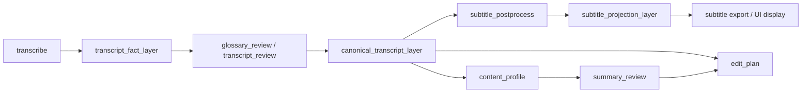

# 2026-04-16 Canonical Transcript Rollout

## 定位

这是一份面向落地的重构方案，不是概念讨论稿。

目标只有一个：把 RoughCut 的字幕与内容理解主链，收敛成“事实层、规范层、投影层”三层架构，并给出可执行的阶段计划、测试矩阵、回归策略和验收门槛。

本次重构默认不考虑旧语义兼容。凡是会继续放大坏字幕、坏摘要、坏剪辑决策的旧路径，都应视为需要替换，而不是长期保留。

## 结论摘要

当前已经落地的核心能力是：

1. `transcript_fact_layer` 作为原始 transcript 事实层，记录 ASR 证据、段落和词级信息。
2. `canonical_transcript_layer` 作为规范 transcript 层，承接术语纠偏、审核确认后的最终文本。
3. `subtitle_projection_layer` 作为字幕投影层，只负责把已稳定的 transcript 投影成可展示字幕。

这三层一旦稳定，后续所有下游链路都应遵循同一个原则：

- `content_profile`、`summary_review`、`edit_plan`、`render` 等步骤消费规范后的 transcript 或其派生物。
- `subtitle_items` 只作为展示结果，不再充当主事实源。
- 任何“从字幕倒推内容理解”的路径，都应视为退化路径。

## 当前已落地现状

截至 `2026-04-16`，主链路已经具备以下结构性改造：

1. `transcribe` 会直接落 `transcript_fact_layer`。
2. `subtitle_postprocess` 会产出 `subtitle_projection_layer`。
3. `glossary_review` 之后会形成 `canonical_transcript_layer`，作为后续理解与编辑的优先输入。
4. `content_profile` 已改成优先消费 `canonical_transcript_layer`，其次才回退到更早的 transcript 事实层。
5. `edit_plan` 也已改成优先消费 canonical transcript，而不是直接从原始 `subtitle_items` 倒推删减决策。

这意味着项目已经从“单层字幕管线”进入“事实层 -> 规范层 -> 投影层”的雏形阶段，但仍需要补齐完整的阶段边界、验收标准和回归约束。

## 目标架构

### 三层定义

`transcript_fact_layer`

- 保存原始 ASR 证据。
- 允许包含段级、词级、来源模型、对齐信息和原始文本。
- 语义是“发生了什么”，不是“最终应该展示什么”。

`canonical_transcript_layer`

- 保存经过术语确认、纠错、重对齐后的规范 transcript。
- 语义是“最终可消费的内容事实”。
- 下游理解、编辑、摘要、包装应优先消费这一层。

`subtitle_projection_layer`

- 保存展示侧字幕投影。
- 允许为可读性做断句、切条、节奏优化。
- 不能反向充当事实源。

## 完整落地阶段

### Phase 0: 现状冻结与基线确认

目标：

- 明确现有已落地 artifact 的职责边界。
- 固化一组 golden jobs 作为回归基线。
- 将“字幕=事实”的旧认知从文档和流程中剥离。

交付物：

- 这份 rollout 文档。
- 设计索引更新。
- 一组固定的回归样本定义。

验收标准：

- 所有团队成员可以用同一套术语描述三层架构。
- 现有 artifact 的主消费方向清晰且无歧义。

### Phase 1: 事实层闭环

目标：

- 让 `transcript_fact_layer` 成为所有下游的起点事实。
- 确保 transcript 事实可以被稳定读取、比对和回放。

交付物：

- transcript 事实层的统一读取约定。
- transcript 事实层的 schema 文档化。
- transcript fact 的基础回归测试集合。

验收标准：

- `transcribe` 的输出可稳定回放。
- transcript fact 中的段、词、时间信息与原始转写结果一致。
- 对同一输入多次运行时，事实层结构可保持稳定。

### Phase 2: 规范层闭环

目标：

- 把术语纠偏、人审确认、必要的修订结果收敛成 `canonical_transcript_layer`。
- 让规范层成为 `content_profile` 和 `edit_plan` 的优先输入。

交付物：

- canonical transcript 的显式阶段边界。
- 规范层的优先级选择逻辑。
- 从 canonical transcript 反推 profile/edit 的稳定路径。

验收标准：

- `content_profile` 默认优先吃 canonical transcript。
- `edit_plan` 默认优先吃 canonical transcript。
- 规范层缺失时，才允许回退到 transcript fact，并记录回退原因。

### Phase 3: 投影层重构

目标：

- 把 `subtitle_postprocess` 明确定位为字幕投影器，而不是事实修正器。
- 让字幕展示规则和事实修正规则彻底分离。

交付物：

- subtitle projection 的独立 contract。
- 字幕断句、展示节奏、短句合并等规则归入投影层。
- 导出层只消费投影结果。

验收标准：

- `subtitle_projection_layer` 可由 canonical transcript 重新生成。
- 投影层不再承担事实修订职责。
- 字幕展示问题不会反向污染事实层。

### Phase 4: 下游消费者迁移

目标：

- 让 `content_profile`、`summary_review`、`edit_plan`、`render`、`final_review` 统一消费 canonical transcript 或其派生物。
- 清除“字幕倒推理解”的隐性路径。

交付物：

- 所有主要消费者的输入优先级策略统一。
- 对旧路径的显式 fallback 约束和日志。
- 下游 artifact 的派生关系明确化。

验收标准：

- 在正常链路上，主要消费者不再依赖 `subtitle_items` 作为事实源。
- 回退路径只在缺失 canonical transcript 时出现。
- 回退路径可被日志和测试明确识别。

### Phase 5: 回归硬化与移除退化路径

目标：

- 让系统在新架构下完成稳定运行。
- 将退化路径保留为临时兜底，而不是长期主逻辑。

交付物：

- 退化路径清单。
- 回归测试矩阵。
- 变更后观察指标和人工复核清单。

验收标准：

- golden jobs 全部通过。
- 核心 artifact 的字段和优先级稳定。
- 下游消费链不存在新的事实源分叉。

## 测试矩阵

| 测试层级 | 覆盖对象 | 关注点 | 期望结果 |
|---|---|---|---|
| 单元测试 | artifact builder、优先级选择、结构化转换 | schema 是否稳定、字段是否齐全、顺序是否正确 | 关键 contract 可重复构建 |
| 组件测试 | `transcribe`、`glossary_review`、`subtitle_postprocess`、`content_profile` | 三层 artifact 是否按预期落地 | 各层输入输出一致 |
| 流程测试 | `pipeline.steps` 中的主链 | 是否按事实层 -> 规范层 -> 投影层流转 | 依赖顺序正确，回退明确 |
| 回归测试 | golden jobs / 历史问题样本 | 品牌、型号、数字、长句、断句、重对齐 | 无明显退化 |
| 人工验收 | 真实素材的字幕和画像 | 可读性、可审性、可编辑性 | 达到产品可交付标准 |

### 推荐回归样本集

1. 品牌型号密集素材。
2. 长口播素材。
3. 多轮停顿和自我修正素材。
4. 含数字、单位、时间点的素材。
5. 术语词典命中率高的素材。
6. 之前出现过字幕乱序、短碎句、错分句的素材。

### 关键断言

- `transcript_fact_layer` 必须存在，并保留事实证据。
- `canonical_transcript_layer` 必须能被上游确认结果稳定驱动。
- `subtitle_projection_layer` 必须能从 canonical transcript 重新生成。
- `content_profile` 和 `edit_plan` 的主输入必须优先 canonical transcript。
- 任何回退到字幕文本的路径都必须可观测、可定位、可回放。

## 回归策略

### 基本原则

1. 只从最早变化的层开始回归，不从下游补救上游。
2. 一旦事实层发生变化，必须重跑规范层和投影层。
3. 一旦规范层发生变化，必须重跑投影层和所有下游消费者。
4. 一旦投影层发生变化，只影响展示和导出，不应回写事实层。

### 回归顺序

建议顺序如下：

1. `transcribe` 相关测试。
2. `glossary_review` / canonical transcript 相关测试。
3. `subtitle_postprocess` / subtitle projection 相关测试。
4. `content_profile` / `summary_review` 相关测试。
5. `edit_plan` / `render` / `final_review` 相关测试。
6. golden jobs 的端到端回归。

### 回归判定

出现以下任一情况，应视为回归失败：

- canonical transcript 优先级被字幕层覆盖。
- subtitle projection 反向污染事实层。
- content profile 再次以 subtitle excerpt 为主输入。
- edit plan 退回到从坏字幕直接删减内容。
- 导出结果和内部事实层产生不可解释的不一致。

## 风险清单

### 风险 1: 层间语义漂移

描述：

- 事实层、规范层、投影层的职责如果没有被测试锁死，很容易重新混用。

缓解：

- 在文档、命名和测试里都固化层边界。
- 对每层 artifact 做单独 contract 断言。

### 风险 2: 规范层重对齐引入新错误

描述：

- canonical transcript 的修订如果没有稳定的对齐和证据链，可能把好证据改坏。

缓解：

- 每次修订都保留来源和证据。
- 允许按最小步骤回退到 transcript fact。

### 风险 3: 下游消费者残留旧输入逻辑

描述：

- 某些消费者可能仍然默认读取 `subtitle_items`。

缓解：

- 通过测试和日志定位所有旧路径。
- 将旧路径限定为明确 fallback，而不是默认逻辑。

### 风险 4: 历史数据与新架构不一致

描述：

- 旧 job、旧 artifact、旧导出结果可能没有三层结构。

缓解：

- 将历史数据视为只读样本。
- 新链路只保证新生成数据满足 contract。

### 风险 5: 回归规模扩大

描述：

- 三层架构后，测试矩阵会比过去更大。

缓解：

- 固定 golden jobs。
- 以最小变更面重跑。
- 将失败定位到具体层，而不是整链重试。

## 验收标准

### 架构验收

- 三层 artifact 命名稳定。
- 每层职责可以被单独说明。
- 主链路的依赖顺序清晰且可追踪。

### 功能验收

- transcript 事实可稳定保存和读取。
- canonical transcript 能承接纠错和确认。
- subtitle projection 能独立生成展示字幕。
- 下游画像和编辑决策优先消费规范 transcript。

### 质量验收

- 品牌、型号、数字、单位类信息在规范层不再被字幕层稀释。
- 字幕展示质量提升不会以破坏事实为代价。
- 端到端链路上的回退原因可观测。

### 回归验收

- golden jobs 全量通过。
- 核心测试矩阵无新增失败。
- 不出现新的事实源分叉。

## 建议的实施顺序

1. 固化本方案和设计索引。
2. 以 golden jobs 建立回归基线。
3. 继续补齐 canonical transcript 的显式阶段边界。
4. 完成下游消费者对 canonical transcript 的统一接线。
5. 收紧 subtitle projection 的职责范围。
6. 清理不再需要的退化路径。

配套执行手册见：[2026-04-16 canonical transcript execution plan](./2026-04-16-canonical-transcript-execution-plan.md)。

## 维护规则

1. 新增或调整 artifact 时，先更新这份文档，再改实现。
2. 新增消费者时，必须写清楚它消费的是哪一层。
3. 任何“既是事实又是展示”的设计，都默认是错误设计。
4. 如果某条回退路径保留超过一个迭代周期，就应重新审视它是否已经变成主逻辑。
