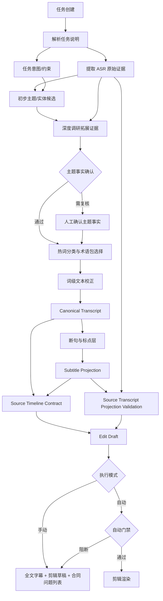

# 源时间轴合同重构方案

日期：2026-05-16

## 核心判断

现有字幕对齐、断句、剪辑校正的问题不是某个规则不够细，而是事实层错位：

- `ASR transcript`、`display subtitle`、`edit decision` 混在一起互相补锅。
- 字幕条目被当成语音事实，导致坏断句反向影响剪辑。
- 剪辑结果缺少对源语音和停顿的守恒审计，隐藏、剪掉、屏蔽都可能没有显式原因。
- 断句逻辑错误地接触时间戳，导致为了句子通顺而移动了不该动的源时间。

新框架必须以源时间轴为唯一事实层。ASR 时间戳不可移动；字幕和剪辑只能引用、投影、裁剪源时间轴，不能改写源时间。

## 新主流程

## 不可变规则

1. ASR token 和 segment 的 `start/end` 是源事实，任何 LLM、热词、断句、字幕投影都不能移动它。
2. 可修改的只有文本内容，修改必须保留到词级 token 的审计来源。
3. 断句只影响标点、字幕条目组合和展示换行，不影响 token 时间戳。
4. 剪辑只能通过 keep/remove 源时间范围改变输出，不能制造新的源时间。
5. 任何被剪掉的语音必须有显式语音原因，例如 `filler_word`、`repeated_speech`、`restart_retake`、`manual_cut`。
6. 任何被剪掉的停顿必须有显式停顿原因，例如 `silence`、`timing_trim`、`long_non_dialogue`。
7. `hidden` 不作为默认功能。绝大多数不展示内容必须进入 remove 段；必须隐藏时，需要独立的 `display_suppressed_reason`，不能伪装成剪辑。
8. 自动渲染必须通过源时间轴合同。阻断问题存在时，只能进入人工审阅。
9. 热词分类和词级校正必须等主题事实确认后才能进入自动链路；否则容易把“相似领域热词”错误套到当前视频。

## 层级职责

### Task Intent

输入任务说明、工作流模板、人工补充说明。输出结构化意图：

- 视频主题候选
- 所属分类候选
- 平台/风格约束
- 禁止剪掉的主体信息
- 热词类别选择提示

### ASR Evidence

保存原始 ASR 证据：

- provider
- model
- attempt id
- segment timing
- token timing
- confidence
- raw payload
- alignment source

这层只追加，不覆盖。

### Preliminary Topic Candidates

LLM 同时读取任务说明和 ASR 全文，输出视频主题、类别、产品/人物/场景实体。这个阶段只产出候选，不直接驱动热词。

### Research Evidence And Topic Fact Confirmation

深度调研拓展证据必须在热词选择前执行。它消费：

- 任务说明、文件名、人工摘要
- ASR/canonical transcript 候选文本
- OCR/视觉语义线索
- LLM 初步主题和实体候选
- 在线搜索结果
- 内部已确认实体库、历史人工确认结果
- 相关热词包中的品牌、型号、别名

输出 `topic_fact_confirmation`：

- `confirmed`: 主题事实是否足够进入自动链路
- `subject`: 已确认的 domain、brand、model、type、theme、summary
- `support_sources`: ASR、任务说明、OCR、视觉、在线调研、内部实体库、人工确认等证据来源
- `research_expansion`: 使用过的查询词和外部/内部证据数量
- `conflicts` / `uncertainties` / `review_reasons`

原则：

- 外部搜索是佐证，不覆盖视频直接证据。
- 任务说明和人工确认是强约束，但仍要保留来源。
- 品牌/型号缺少在线或内部实体交叉印证时，自动链路不能盲目扩大热词。
- 主题事实未确认时，热词分类只能进入候选，不得自动改写字幕。

### Topic And Hotword Resolution

热词解析基于 `topic_fact_confirmation.subject` 和 `support_sources` 选择术语包，而不是只靠字幕局部文本猜测。

当前执行约束：

- 如果 `topic_fact_confirmation.status != confirmed`，来源身份派生热词不会注入 `effective_glossary_terms`。
- 如果主题事实未确认，已有词级候选里的 `auto_applied=true` 会在 `subtitle_term_resolution_patch` 中降级为待审。
- patch 会记录 `automatic_rewrites_allowed` 和 `evidence.topic_fact_confirmation`，让人工复核知道为什么没有自动改写。

### Word-Level Correction

热词和 LLM 只能改 token 文本，不改 token 时间。每个修正保留：

- `original_text`
- `corrected_text`
- `reason`
- `evidence`
- `confidence`
- `source`

### Sentence And Punctuation

断句层从 canonical tokens 生成句子和字幕展示单元：

- 允许补标点。
- 允许合并/拆分展示条目。
- 允许让中文词保持完整表达。
- 禁止修改任何 token `start/end`。
- 条目的时间只能由包含的 token 派生。

### Edit Draft

剪辑层消费 canonical transcript、VAD 停顿、场景边界和任务意图。它产出 remove/keep 段，每个 remove 必须有原因和证据。

剪辑层不再直接用 display subtitle 判断低信号内容。`low_signal_subtitle` 只能作为人工审阅提示，不能作为可信语音的自动删除依据。

字幕文本规则只允许处理明确的语音现象，例如开头语气 filler 或重复复读。只要存在 ASR transcript：

- 规则剪切必须被 ASR 可信词确认。
- 覆盖正常 ASR 词的字幕规则剪切会被丢弃。
- 只有无可信词覆盖、或可信词本身就是 filler/repeated speech 时，才允许形成自动剪切候选。

### Source Timeline Contract

合同层审计三件事：

- 源语音 token/segment 是否被剪掉，原因是否成立。
- 源语音是否保留但没有字幕覆盖。
- 源语音是否保留但字幕被清成空显示，且是否带 `display_suppressed_reason`。
- 源停顿是否被剪掉或长期保留，是否有显式说明。

合同输出进入 `EditDecision.analysis.source_timeline_contract`，自动渲染读取 `automatic_gate`。

### Source Transcript Projection Validation

投影校验不再只比较剪后字幕和旧字幕条目的文本相似度。新增一层直接以 ASR 源词/段为基准：

- 把输出字幕时间映射回源时间轴。
- 对每个被 keep 段覆盖的 ASR token/segment 检查是否存在非空字幕覆盖。
- 可信 provider 时间缺字幕时阻断自动渲染。
- 合成/回填时间缺字幕时进入警告，避免把不可靠时间戳误判成硬失败。
- 被真实剪掉的语音不要求字幕覆盖，但其剪掉原因仍由 `source_timeline_contract` 审计。

该结果落入 `render_plan.subtitle_source_projection_validation` 和 `edit_review_bundle.subtitle_source_projection_validation`。如果阻断，`automatic_gate.blocking_reasons` 增加 `subtitle_source_projection_validation_blocking`。

## 当前代码落点

本次重构已建立第一层硬合同：

- `src/roughcut/edit/timeline_contract.py`
  - 定义源语音单元和停顿单元。
  - 审计剪辑草稿对源时间轴的处理。
  - 对保留语音的空显示字幕输出 `kept_speech_display_suppressed`，并保留 `display_suppressed_reason`。
  - 区分阻断问题和警告问题。
- `src/roughcut/edit/decisions.py`
  - `build_edit_decision()` 产出 `source_timeline_contract`。
  - `automatic_gate` 根据合同阻断状态生成。
  - LLM 复核修改剪辑后可刷新合同。
  - 字幕规则剪切在有 transcript 时必须通过 ASR 可信词确认。
- `src/roughcut/media/subtitle_text.py`
  - 清成空显示的字幕会标记 `display_suppressed_reason`，避免隐藏路径无审计。
- `src/roughcut/pipeline/steps.py`
  - `edit_plan` 在 LLM 复核后刷新合同。
  - `render_plan` 携带合同和自动门禁。
  - `render` 在门禁阻断时停止自动渲染。
- `src/roughcut/review/topic_fact_confirmation.py`
  - 把内容理解、深度调研、任务说明、ASR、视觉/OCR、内部实体证据汇总成主题事实确认快照。
  - `content_profile` 和 `enrich_content_profile` 产出 `topic_fact_confirmation`。
  - 自动确认评估会读取该快照，把未确认主题事实列入复核原因。
- `src/roughcut/review/subtitle_term_resolution.py`
  - 未确认主题事实时，自动词级改写降级为待审候选。
  - patch 记录主题事实证据快照。
- `src/roughcut/pipeline/steps.py`
  - 未确认主题事实时不注入来源身份派生热词。
  - `edit_plan` 额外落 `edit_review_bundle`，包含全文字幕、剪辑草稿、剪后字幕、主题事实确认、源时间轴合同和自动门禁。
  - `render_plan` 额外落 `subtitle_source_projection_validation`，保留但未出字幕的可信 ASR 语音会阻断自动门禁。
  - `run_edit_plan()` 返回自动门禁摘要，自动链路可以在 render 前看到阻断状态。
- `src/roughcut/media/subtitle_projection_validation.py`
  - 保留旧的源字幕文本漂移修复。
  - 新增 `validate_projected_subtitles_against_transcript()`，以 ASR 词/段为源事实检查剪后字幕覆盖。

## 必须删除或收缩的旧职责

- 删除“字幕条目是事实层”的隐含使用。
- 删除基于 display subtitle 的核心删减逻辑。
- 删除断句逻辑修改时间戳的能力。
- 删除默认隐藏语音的路径。
- 收缩 `polish_subtitle_items()`：它只能改文本，不能承担结构补救。
- 收缩投影校验：它必须对齐 ASR/canonical transcript，而不是只对齐旧字幕条目。

## 验收标准

1. 任意可信 ASR 语音被剪掉，必须能在合同中看到原因。
2. `silence/timing_trim/micro_keep` 等非语音原因剪掉可信语音时，自动门禁阻断。
3. 保留的可信语音必须有字幕覆盖，否则阻断。
4. 保留的可信语音如果被字幕清洗屏蔽显示，必须在合同中显示 `display_suppressed_reason`，并阻断自动渲染。
5. 被剪掉的停顿必须有原因。
6. 长停顿被保留时至少进入警告列表。
7. 手动模式必须展示全文字幕、剪辑草稿、合同问题列表。
8. 自动模式只有合同通过才能渲染。
9. 热词自动校正前必须存在 `topic_fact_confirmation`，且品牌/型号类事实必须有直接视频证据或调研/实体库/人工确认交叉印证。
