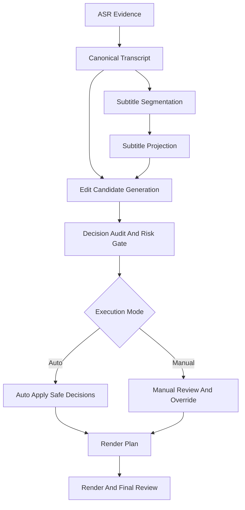

# 自动剪辑质量恢复与阶段化重构方案

日期：2026-06-08

## 目标

把 RoughCut 当前“规则混叠、阶段串写、结果不可解释”的自动剪辑链路，收敛成一条可以稳定批量跑任务的主线。

短期目标不是追求最强精修，而是快速恢复一条可用的高通量自动剪辑链：

- 自动模式可以稳定批量产出中高质量初剪。
- 手动模式可以看到同一条合同下的可解释投影和删除建议。
- 任意字幕、切分、删减、隐藏、润色行为都能定位到唯一阶段和唯一原因。

## 当前诊断

### 现象

- 规则命中数和实际高亮不一致。
- 语气词、口头禅、停顿、重复口误会互相串扰。
- 正常词语或产品名被误标为可删除。
- 全文剪辑中出现大段缺失、时间错位、灰色无法解释删除。
- 手动编辑器和自动剪辑对同一任务看到的字幕投影不一致。
- 已完成任务整体可下载，但真实任务的手动编辑阶段仍存在 `500` 和生产可用性问题。

### 第一坏层

第一坏层不是某一个规则，而是阶段边界失真：

- `transcript text`
- `canonical text`
- `subtitle projection`
- `edit candidate`
- `final keep/remove decision`

这几层在多个步骤里被重复修改，导致任何问题都很难定位到“第一次变坏”的地方。

### 根因归纳

1. 多个阶段同时做切分
   - 字幕构造、全文投影、手动编辑回读、应用剪辑后重投影，都在不同位置碰边界。
2. 多个阶段同时做文本清洗
   - 语气词清洗、术语修复、展示清理、规则匹配使用的文本表面不统一。
3. 多个阶段同时做删减判断
   - 规则卡片、投影高亮、智能删减、最终时间线都可能各自“觉得该删”。
4. 缺少统一候选合同
   - 系统经常直接标记删除，而不是先产出“候选 + 证据 + 风险级别”。
5. 缺少全链路可观测性
   - 当前前端能看到颜色，但看不到“由哪个阶段、哪条规则、基于哪个文本表面、以什么证据产生”。

### 为什么现在暴露得更严重

近期围绕 canonical transcript、source timeline、manual editor projection 做了大规模重构，合同方向是对的，但旧的隐式兜底和历史 fallback 还留在链路里。结果是：

- 新合同开始收紧。
- 旧逻辑还在跨阶段补锅。
- 同一条文本被多次重写、重切、重匹配。

因此问题从“偶发误删”升级成“系统级行为不一致”。

## 设计原则

1. 一阶段一动作
   - 一个阶段只负责一种主动作：识别、校正、切分、投影、候选生成、最终决策、渲染。
2. 一份事实，多份派生
   - 源时间与原始识别事实不可回写；后续一切都是派生物。
3. 先候选，后裁决
   - 所有自动删除都先变成候选，不允许规则直接改最终时间线。
4. 显示和决策分离
   - 展示字幕为阅读服务，剪辑决策为删除服务，不能互相偷用对方的隐式结论。
5. 自动和手动共用合同
   - 手动模式不是第二条流水线，只是对同一套合同进行确认、撤销、替换和精修。
6. 先恢复 90 分生产力，再做 100 分精修
   - 先解决高频全局错误、恢复稳定链路，再上多模态和更复杂策略。

## 目标主线



## 唯一阶段职责

| 阶段 | 主要输入 | 主要输出 | 允许动作 | 禁止动作 |
|---|---|---|---|---|
| `ASR Evidence` | 音频、ASR provider payload | 原始 segment/token/time/confidence | 记录原始识别结果 | 术语矫正、断句、删减 |
| `Canonical Transcript` | ASR evidence、术语/人工确认 | 词级标准文本 | 改文本、不改时间 | 改 token 边界、改展示切分、做删减 |
| `Subtitle Segmentation` | canonical transcript、时长/阅读约束 | 句级/条级边界 | 自动切分展示单元 | 改词文本、删词、删段 |
| `Subtitle Projection` | segmentation、展示样式 | 全文显示字幕、预览字幕 | 投影、换行、样式控制 | 术语矫正、规则删减、时间线删除 |
| `Edit Candidate Generation` | canonical transcript、raw transcript、pause/VAD、projection | 删除候选列表 | 生成候选和证据 | 直接删最终时间线 |
| `Decision Audit And Risk Gate` | 候选列表、source timeline contract | 安全候选、阻断原因、人工候选 | 去重、合并、风险评级、阻断 | 重写字幕文本或重新切分 |
| `Manual Review` | 候选、projection、合同诊断 | 人工确认后的覆盖 | 确认/撤销/替换/文本微修 | 回写 ASR 事实 |
| `Render Plan` | 安全候选 + 人工覆盖 | keep/remove timeline、final subtitle source | 组装最终渲染输入 | 重新做规则判断 |

## 三层文本表面

系统内显式保留三层文本，不能再混用：

### 1. `transcript_text_raw`

- 来自 ASR 或对齐后的原始口播文本。
- 保留噪声、语气、重复、识别错误痕迹。
- 主要用于规则匹配、调试追责、错误分析。

### 2. `transcript_text_canonical`

- 经过术语和事实校正后的标准文本。
- 不承担展示切分。
- 主要用于内容理解、术语统一、主体提取。

### 3. `subtitle_text_display`

- 为阅读和成片展示服务的投影文本。
- 允许标点、换行、轻量阅读优化。
- 不再作为规则识别或删除判断的事实层。

## 切分逻辑的唯一归属

切分只允许发生在 `Subtitle Segmentation` 阶段。

这意味着：

- 自动模式一定会切分。
- 手动模式看到的也是自动切分后的投影。
- 手动模式可以对文本做小范围覆盖，但不能变成另一套隐藏切分引擎。
- 后续阶段只能引用切分结果，不能悄悄再分一次。

## 规则体系重构

### 规则只生成候选，不直接删除

每一条规则都输出统一结构：

```json
{
  "candidate_id": "cand_xxx",
  "category": "filler|catchphrase|repeated_speech|pause|low_signal|retake",
  "match_surface": "raw|canonical|display",
  "stage": "edit_candidate_generation",
  "rule_id": "filler.independent",
  "start": 12.34,
  "end": 12.66,
  "text": "啊",
  "evidence": {
    "token_ids": ["tok_1", "tok_2"],
    "confidence": 0.91,
    "pause_before": 0.18,
    "pause_after": 0.22
  },
  "risk_level": "low|medium|high"
}
```

### 语气词拆成三个子规则

- `independent_filler`
  - 单独成段或近似单独成段，默认勾选，优先自动删。
- `leading_filler`
  - 句头语气，默认关闭或仅做候选，避免删出突兀开头。
- `trailing_filler`
  - 句尾语气，默认关闭或仅做候选，避免删出硬切收音。

### 口头禅独立成类

- 与语气词完全分离。
- 使用独立可编辑词表。
- 仅在满足句法与语义完整性保护时，才允许自动删。

### 停顿和重复口误单独建模

- `pause_trim` 只处理无语音区间。
- `repeated_speech` 只处理同源重复。
- 两者都不得越权删正常语义词。

## 自动模式与手动模式

### 自动模式

- 自动应用 `low risk` 候选。
- `medium/high risk` 候选进入阻断或候选池。
- 必须通过 source timeline contract 和 projection validation。

### 手动模式

- 看的是自动切分后的投影。
- 操作对象是候选、覆盖和文本精修。
- 不重跑第二套隐式删除逻辑。

手动模式的价值是确认和修正，而不是补救一条结构失控的流水线。

## 多模态方案的位置

多模态不是替代主链，而是 `Decision Audit And Risk Gate` 的增强器。

推荐只用于高风险候选复核，例如：

- 文本看起来信息量低，但视频在展示关键细节。
- 文本存在歧义，不确定是语气词还是真实语义。
- 长静默区可能是产品展示、镜头切换或操作步骤。

因此多模态位置应当是：

- 文本规则先产出候选。
- 语义/合同审计先做保护。
- 仍然高风险的候选再交给多模态复核。

而不是先把整段视频交给多模态去重做一遍完整剪辑。

## 真实任务的短期质量目标

恢复到可批量使用的自动剪辑能力，至少要达到以下标准：

1. 手动编辑器真实任务可稳定打开，无 `500`。
2. 所有删除和高亮都能追溯到唯一候选来源。
3. 语气词、口头禅、停顿、重复口误互不串扰。
4. 不再出现无出处的灰色删除和跨阶段自动删除。
5. 展示字幕不再系统性出现超长、残句、时间错位和大段缺失。
6. 自动模式默认走保守高召回保护，不追求过高压缩比。

## 建议分阶段实施

### Phase 0: 止血与合同收口

- 恢复 manual editor 可用性。
- 去掉跨阶段 fallback 串写。
- 给候选和投影补足来源诊断字段。

### Phase 1: 文本与切分归位

- 锁定三层文本表面。
- 锁定切分唯一归属。
- 收敛展示字幕构造。

### Phase 2: 候选型自动剪辑

- 把规则改成候选生成器。
- 建立风险门禁和自动应用阈值。
- 恢复语气词/口头禅/停顿/重复的可解释性。

### Phase 3: 质量增强

- 低信息废片句段识别。
- 多模态高风险候选复核。
- 创作者反馈回灌。

## 验收指标

### 可用性

- 真实任务 manual editor 成功加载率
- 自动模式完整跑通率
- 渲染后 review bundle 可解释率

### 字幕质量

- 超长字幕率
- 残句率
- 时间错位率
- 术语格式化错误率

### 剪辑质量

- 误删率
- 漏删率
- 断句突兀率
- 人工撤销率

### 生产力

- 每条视频人工介入时长
- 可直接交付比例
- 批量任务平均压缩时长

## 方法论依据

本方案不是临时拼凑，主要基于三类成熟方法：

1. 非破坏式剪辑和 EDL 思路
   - 事实素材与派生决策分离。
2. 字幕/转写分层
   - raw transcript、canonical transcript、display subtitle 分层。
3. 人机协同候选审核
   - 先产出候选，再做风险分级、自动门禁和人工确认。

多模态候选复核属于增强层，不是主合同。

## 相关文档

- [源时间轴合同重构方案](./2026-05-16-source-timeline-contract-refactor.md)
- [Canonical Transcript Rollout](./2026-04-16-canonical-transcript-rollout.md)
- [字幕断句与呈现逻辑通用重构方案](./2026-04-12-subtitle-segmentation-refactor.md)
- [剪辑校对流程](../2026-04-14-edit-review-flow.md)
- [Edit Decision Multisignal Refactor](../2026-04-23-edit-decision-multisignal-refactor.md)
