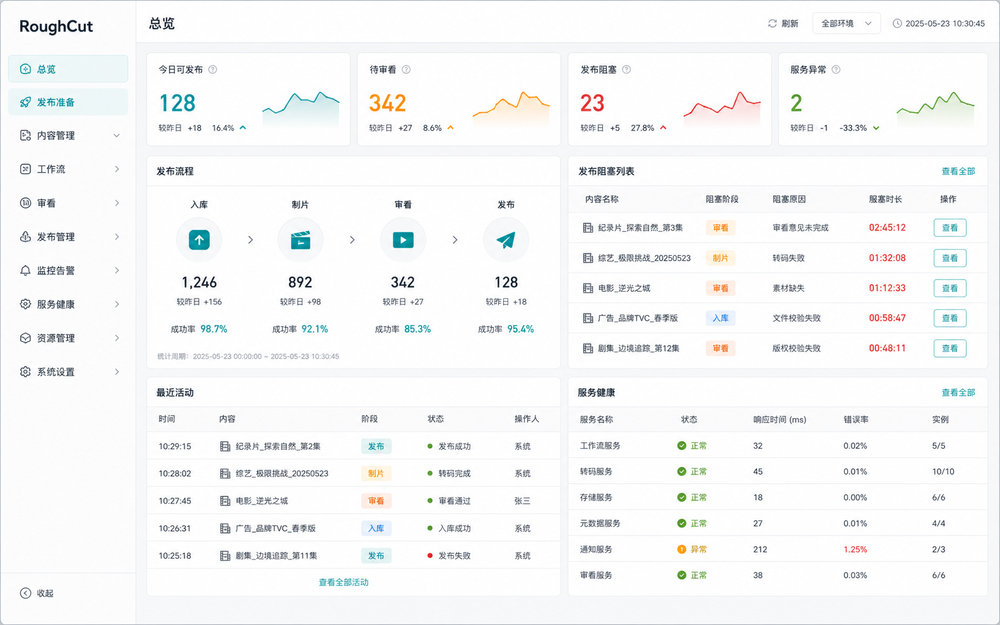
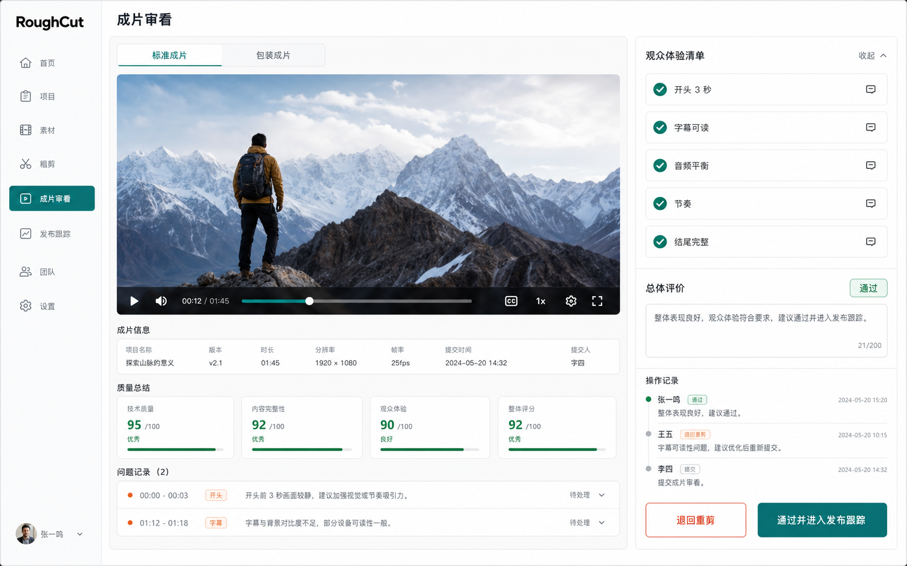
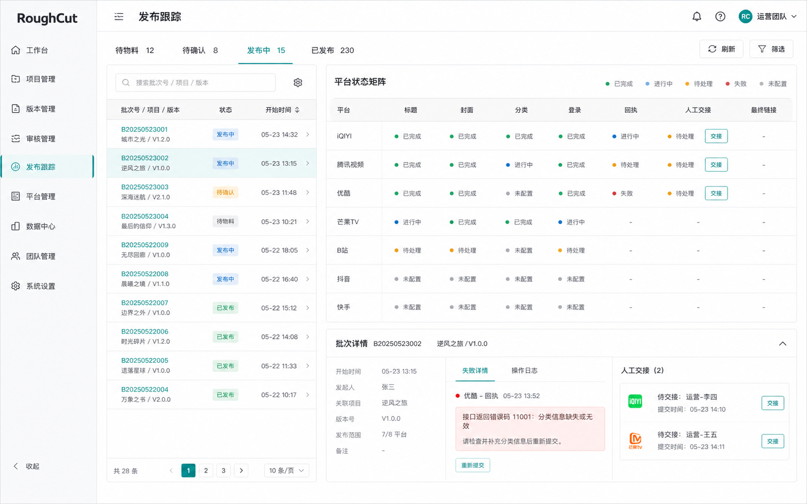

# Frontend Redesign Spec

RoughCut's frontend is an operator console for production, review, publishing,
and runtime control. It should stay dense, direct, and workflow-led. It must not
become a marketing site, event launch surface, or presentation cockpit.

## Visual Language

The unified direction is `RoughCut Operator Console`.

- Use cool white and light gray surfaces with deep ink text.
- Use teal as the single product accent.
- Reserve amber, red, and green for status semantics only.
- Use system sans fonts that render Chinese well.
- Use 8px page/panel radius, 6px controls, and pill status chips.
- Prefer lists, tables, split workspaces, status strips, and inspectors over
  decorative card mosaics.
- Use icons from one family only. The frontend uses `lucide-react`.
- Motion is limited to state transitions, drawer/modal entry, progress, and
  focused feedback.

Reference images:







These images are visual direction only. The shipped UI must use live state,
real API contracts, and accessible HTML controls.

## Primary Navigation

The primary navigation is organized by operator responsibility:

```text
工作流: 总览 / 制片队列 / 成片审看 / 发布跟踪
资产库: 创作者卡片 / 任务策略 / 视觉方案 / 术语与记忆
系统: 工具箱 / 设置 / 服务控制
```

Legacy routes should remain compatible while the new IA settles.

## Page Responsibilities

| Page | Responsibility | Non-goals |
| --- | --- | --- |
| 总览 | System overview, active queue pressure, service health, automation status, recent activity | Editing details, final approval, or publishing forms |
| 制片队列 | Import, queue, production, recovery, rerun, manual editor access | Final audience acceptance or platform tracking |
| 成片审看 | Final video player, candidate versions, audience checklist, pass/return decision | Automated quality gate until backend owns it |
| 发布跟踪 | Material readiness, platform status, attempts, receipts, final URLs, manual handoff | Creator account configuration as the primary task |
| 创作者卡片 | Identity, platforms, assets, preferences, default strategy relationships | Publishing execution |
| 任务策略 | Strategy generation, comparison, activation, review gates | Visual packaging details |
| 视觉方案 | Packaging, subtitles, cover direction, visual constraints, platform adaptation | Publishing execution |
| 术语与记忆 | Glossary maintenance, learned memory, hotwords, correction feedback | Production queue operations |
| 工具箱 | ASR, TTS, and avatar service diagnostics | Main workflow navigation |
| 设置 | Model, quality, runtime, and notification configuration | Task execution |
| 服务控制 | Service health, compensation queue, shutdown, diagnostics | Content or publishing decisions |

## Acceptance Criteria

- A new user can move from 制片队列 to 成片审看 to 发布跟踪 without reading
  internal pipeline names.
- 总览 exposes cross-system attention items without turning the homepage into a publishing cockpit.
- 成片审看 uses the real final video inventory and prefers `enhanced_mp4`
  before `packaged_mp4`.
- 发布跟踪 keeps receipt ids, failure reasons, public URLs, and manual handoff
  actions visible by default.
- Old routes remain available during the first implementation pass.
- Desktop and mobile layouts have no horizontal overflow.
- Buttons do not wrap on desktop, focus states are visible, and empty/loading/
  error states are explicit.

## Verification

Static checks:

```bash
pnpm --dir frontend run typecheck
pnpm --dir frontend run build
pnpm --dir frontend exec vitest run src/App.audit.test.tsx src/pages/page-interactions.audit.test.tsx
```

Live checks:

- Open desktop at 1440x900 and mobile at 390x844.
- Visit every primary navigation entry.
- Confirm there are no uncaught console errors.
- Confirm 成片审看 shows a video element or a clear unavailable state.
- Confirm 发布跟踪 shows platform progress/history with receipt and URL fields
  when data is present.
